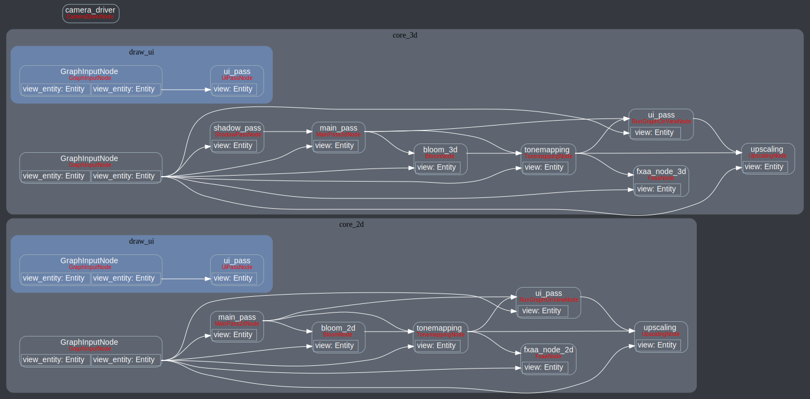
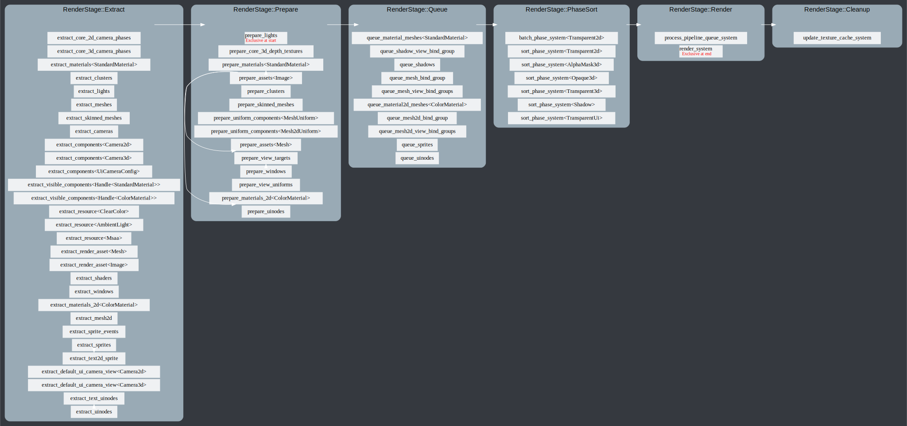
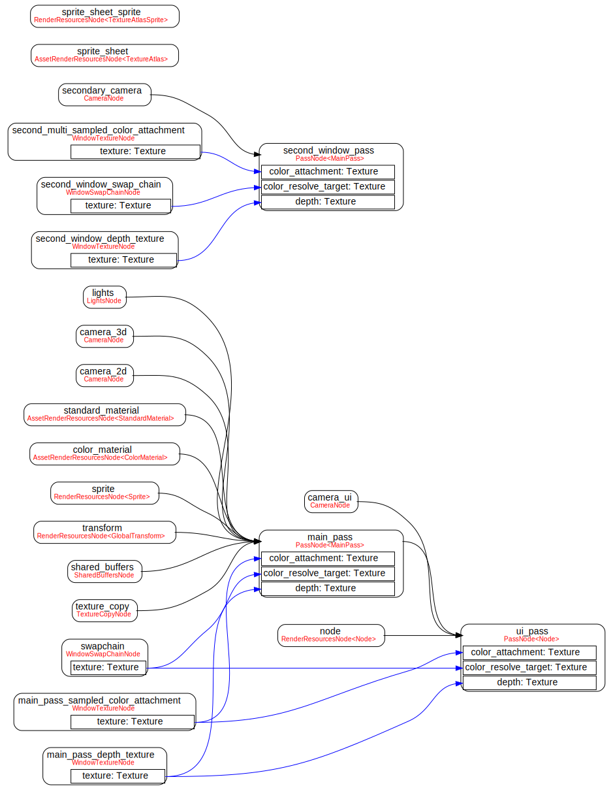
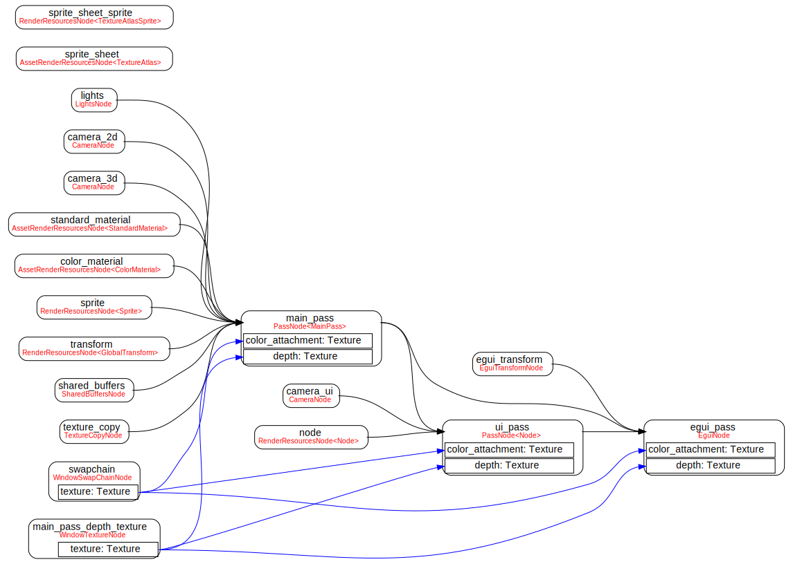
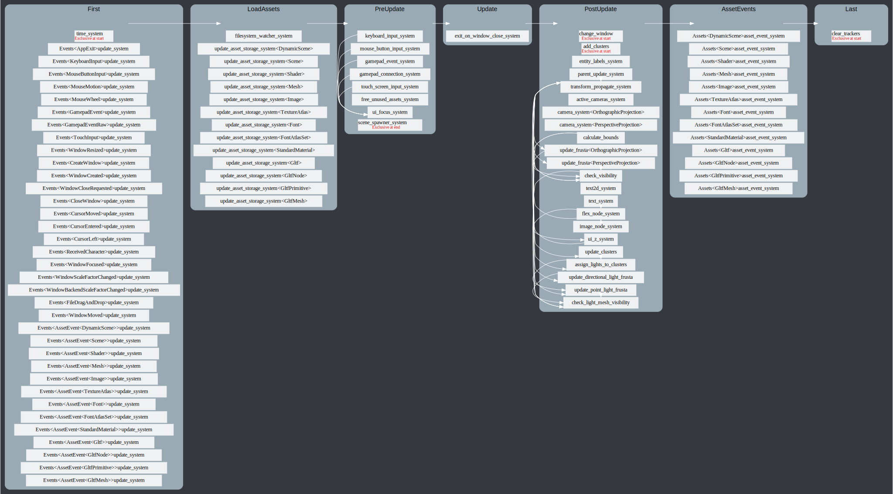

# bevy_mod_debugdump

## Features
### Render Graph
```rust
use bevy::prelude::*;

fn main() {
    App::build()
        .add_plugins(DefaultPlugins)
        .add_startup_system(debug.system())
        .run();
}

fn print_render_graph(render_graph: Res<RenderGraph>) {
    let dot = render_graph_dot(&*render_graph);
    println!("{}", dot);
}
```




<!--
<details>
<summary>render graph for bevy's `multiple_windows` example</summary>


</details>
<details>
<summary>render graph with `egui` plugin</summary>


</details>
-->

### Schedule graph
```rust
use bevy::prelude::*;
use bevy_mod_debugdump::schedule_graph_dot;

fn main() {
    let mut app = App::build();
    app.add_plugins(DefaultPlugins);
    println!("{}", schedule_graph_dot(&app.app.schedule));
}
```



## Bevy support table

|bevy|bevy_mod_debugdump|
|---|---|
|0.5|0.2|
|0.5|0.1|
