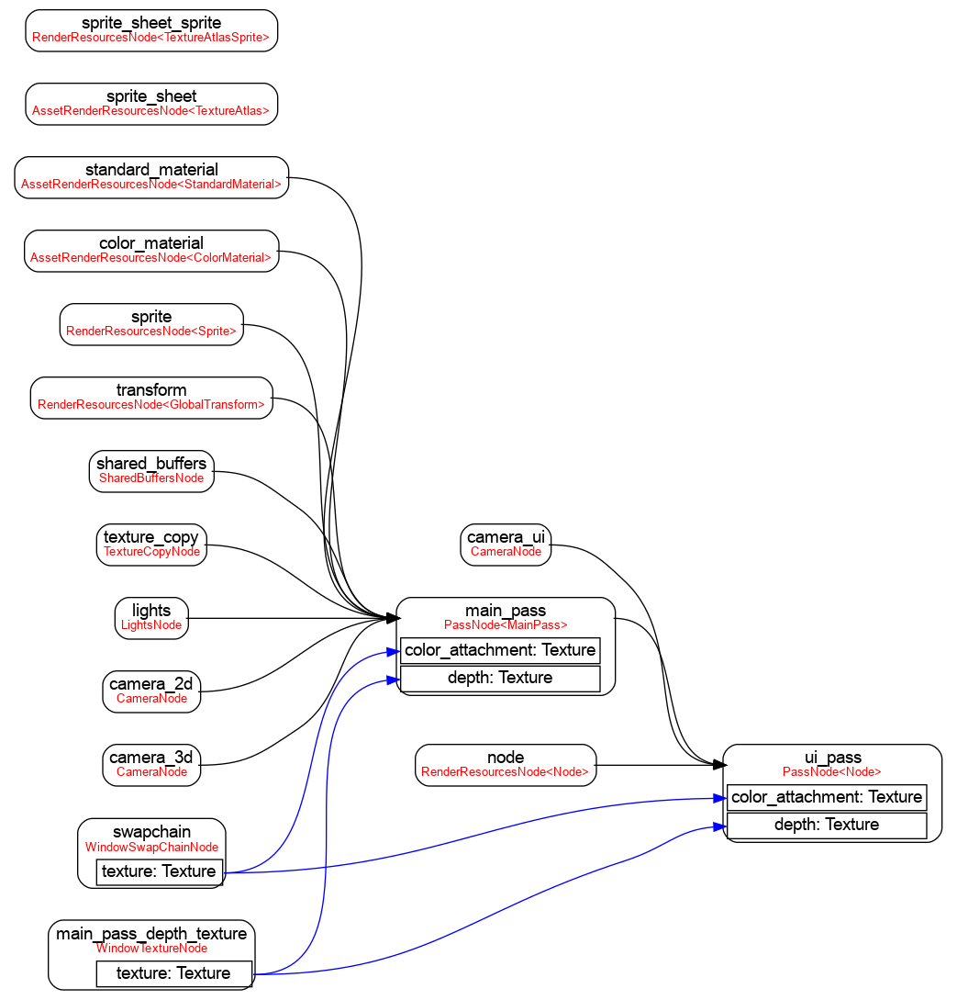

# bevy_mod_debugdump

## Features
### Render Graph
```rust
use bevy::prelude::*;

fn main() {
    App::build()
        .add_plugins(DefaultPlugins)
        .add_startup_system(debug.system())
        .run();
}

fn print_render_graph(render_graph: Res<RenderGraph>) {
    let dot = render_graph_dot(&*render_graph);
    println!("{}", dot);
}
```



### Schedule graph
```rust
use bevy::prelude::*;
use bevy_mod_debugdump::schedule_graph_dot;

fn main() {
    let mut app = App::build();
    app.add_plugins(DefaultPlugins);
    println!("{}", schedule_graph_dot(&app.app.schedule));
}
```

